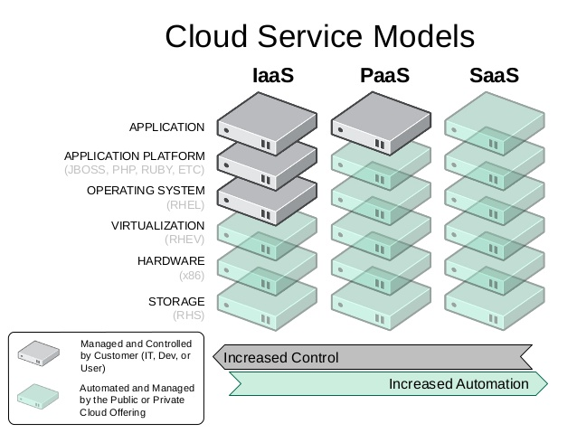
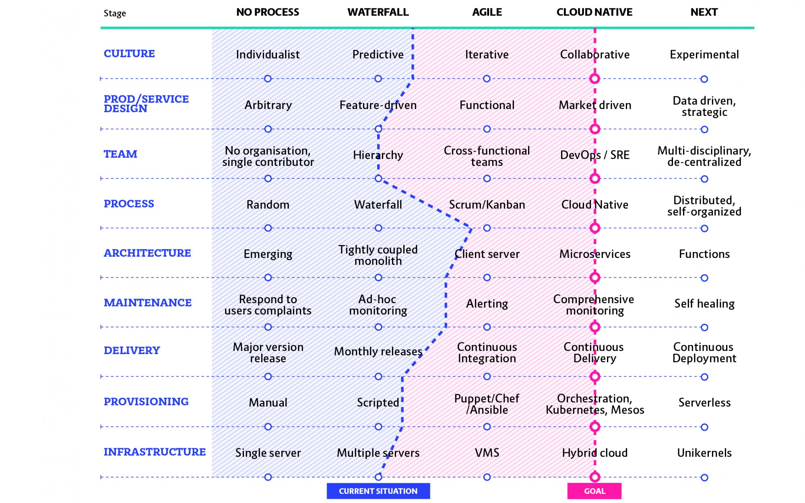

# IaaS, PaaS, SaaS

## IaaS = Infrastructure as a Service
Typically provides a HW (+ OS) platform for its users (eg I need a 2 CPU CentOS7 machine with 2G memory)

- **Scope:** Infrastructure (virtual machines and images, storage, network elements)
- **Advantages:** unified / standard virtualization on strong host machines; rapid machine demand handling and creation (even runtime scaling)
- **Target group:** operators, DevOps
- **Examples:** Amazon EC2, Rackspace, Google Compute Engine, OpenStack. At this lab, the IaaS solution is provided by OpenStack!

## PaaS = Platform as a Service
Typically, application servers, middleware, application runtime environment for users (eg I need a JBoss JEE server or a NodeJs running environment)

- **Scope:** Application Runtime Environments (middleware, application platforms)
- **Advantages:** uniform / standard application development and deployment environment; rapid platform request and creation (even runtime scaling)
- **Target group:** application developers
- **Examples:** OpenShift, Heroku, Google App Engine. At this lab, the PaaS solution is provided by OpenShift!

## SaaS = Software as a Service
Typical ready-to-use applications for their users (eg I need a mail system, CRM application, Webshop, etc.)

- **Scope:** Applications, services
- **Advantages:** I have an immediately available, usable service; no development costs; instead of a one-time investment, regular pay
- **Target group:** end users
- **Examples:** Office Cloud, Google Apps (Forms, Calendar, ...)

# Maturity  levels of cloud technologies
https://container-solutions.com/cloud-native-maturity-matrix/

