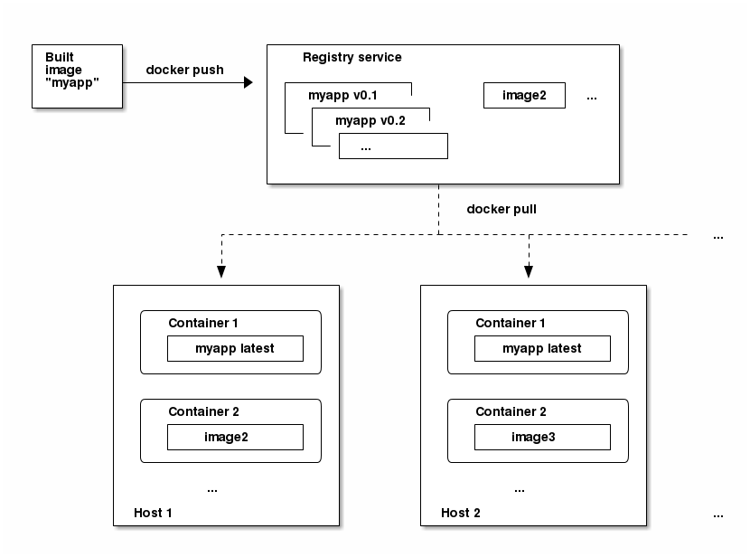

# Docker
## Containers
- LXC, BSD Jails, Docker
  - Chroot circa 1982, FreeBSD Jails circa 2000, Solaris Zones circa 2004, LXC circa 2008, Systemd-nspawn circa 2010-2013
  - Docker circa 2013
- An isolated environment based on Linux kernel technologies
- Isolated namespaces (fs, net, ps, mount, ipc, ...)
- Expanded, fast, secure, optimal resource usage
- Example container creation with basic linux toolset: https://ericchiang.github.io/post/containers-from-scratch/


## Basic concepts
- Docker image: Organized and layered collection of changes to the linux root file system. Cannot be modified. The basis of running containers includes all the information that a container can be copied from.
- Docker container: A runtime copy of an image, an isolated linux process hierarchy. It is based on a Docker image that is complemented with runtime parameters and configurations.
- Docker registry: Image collection 
- Dockerfile: A collection of commands and instructions. Running on a basic image in order, a new customized image will appear in the order above.

https://docs.docker.com/engine/reference/glossary


## Docker architecture


## Windows vs Linux


https://xebia.com/blog/deep-dive-into-windows-server-containers-and-docker-part-2-underlying-implementation-of-windows-server-containers/

## Layers
- The instructions executed on the image form new layers.
- No image can be modified, the container instance also appears as a new layer.
- Container instance can be stored, saved to image.


## Persistent Containers
- The docker containers are not persistent, so the stored data will be lost (if any)
- Persistent storage can be attached to containers


## Network
- Containers can be isolated from the host (net namespace).
Typically, a container is connected to a Linux Bridge that is run by a host (but it is possible to create many different network architectures).
- The container can open ports explicitly (portforward)
- Containers can be interconnected.

## Key commands
```shell
docker help                     -- description of docker help commands
docker image pull               -- image download
docker image search             -- search for a docker image 
docker container run            -- launch a container instance
docker container run -v         -- mount  a persistent bundle
docker container run -it        -- opening an interactive terminal
docker container run -d         -- a container will run as a background process
docker container run -p         -- port forward
docker container ps | top       -- running containers
docker container inspect        -- querying the runtime parameters of the container
docker container start | stop   -- container start, stop
```

## Docker ecosystem
- Docker Machine - Run Docker Containers on virtual machines
- Docker Compose - Docker container stack handling
- Docker Swarm - Docker container clustering

## Docker GUI management
_docker container run -d -p 9000:9000 --privileged -v/var/run/docker.sock:/var/run/docker.sock portainer/portainer_
http://localhost:9000 (specify passwd, then local, connect and voilá, there is a GUI above the local docker environment)
