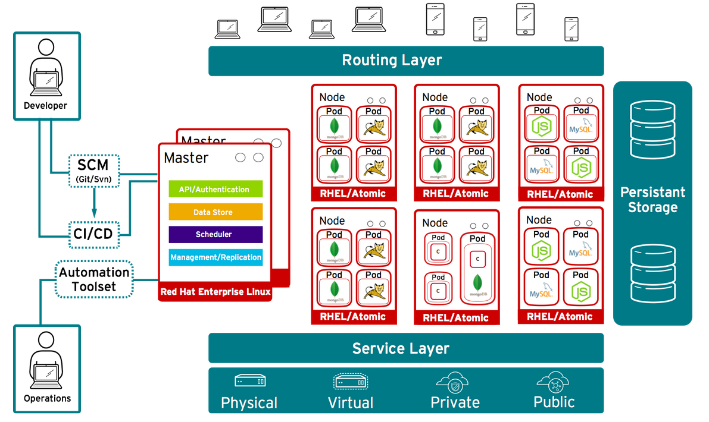
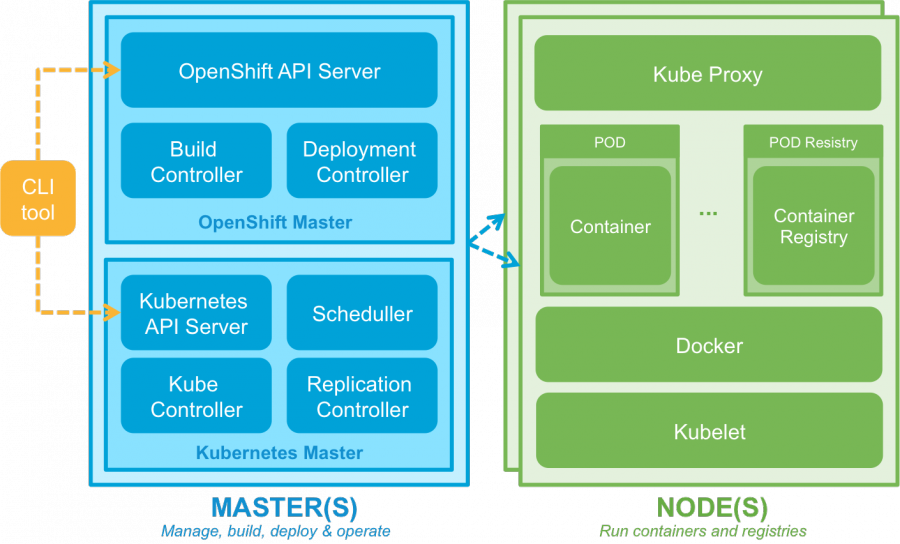

# OpenShift Overview
Docker containers alone are not yet capable of providing a complete PaaS solution.

The following issues need to be solved:
- Connecting and managing different containers is limited if we only build only on Docker. (Scheduling)
- No scaling (either dynamically), failover, high-availability. (Scaling)
- Support application building, deployment processes.
- Tenant / Project Isolation (in a PaaS solution resources / projects / applications separated completely)

There are existing solutions and technologies for these problems:
- Kubernetes, Docker Compose, Docker Swarm - Container Management (Scheduling + Scaling)
- Application development methodologies, tools: Git or other SCM, Jenkins, ...
- Networking tools: Open vSwitch, Linux kernel technologies
- Monitoring: Hawkular

OpenShift solves these problems by building on Docker container technology and other proven tools, primarily for Kubernetes.

# OpenShift OKD
OKD = The Origin Community Distribution of Kubernetes
- a Kubernetes distribution optimized for CI / CD processes and multi-tenant operation
- Origin (before 3.10), now Kubernetes distribution
- formerly the largest contributor project, the source of many Kubernetes features, e.g. Role Based Access Control (RBAC)

[OpenShift history](https://blog.openshift.com/openshift-kubernetes-where-weve-been-and-where-were-going-part-1/)

[OpenShift Future](https://blog.openshift.com/openshift-kubernetes-where-weve-been-and-where-were-going-part-2/)


# Basic concepts
-**Project**: Administrative isolation, individual vendors can work separately on each project. Except for Node, all OpenShift entities are project resources.
- **User**: users of OpenShift whose activity may be restricted by authorization
- **Container, Image, Registry**: OpenShift uses Docker as container technology, so they are exactly the Docker definitions.
- **Pod**: One or more containers with shared storage space, network. Installation, management unit.
- **Node**: Machine running pods.
- **Service**: Represents an internal network port that - in an abstract way - is accessed by the PODs behind and their services. Internal load balancers also.
- **Build, BuildConfig**: Docker image is created from the source code of an application. This process named Build and its parameter is BuildConfig.
The basic components of OpenShift can be described in YAML or they can also be described in JSON format.

# OpenShift Architecture



# Application Development


## Build Process
https://docs.openshift.org/latest/dev_guide/application_lifecycle/new_app.html

Here's how to build applications on OpenShift:

1. Docker: This is practically the Dockerfile based build process
2. S2I -Source to Image: compile the final product based on the source code and a Builder docker image (here also a Docker image)
3. Custom build - A fully customized build process with your own Builder image.
4. Jenkins Pipeline build

The Docker containers are also created for Build! For example, the specified source is compiled by a build container configured with Java + Maven + Nexus.

**BuildConfig**

The configuration of the build, among other things, describes where the source is, what the result of the compilation, what "strategy" to compile, what trigger the compilation, etc.

**Image Stream**

The result of the translation is a Docker Image. The chain of consecutive builds is ImageStream.
Such ImageStream provides a view of one or more Docker images through the tags (eg labels on the web server, on the db, etc.)

### Source Conventions
Sources needs to follow language and technology standards, eg You need  a pom.xml for Java build - Maven build.
In addition, the build process can be customized at several points:

1. Assemble script - customize the packaging of the result product (eg zips, tars, wares, etc.)
2. Run script - How to run the generated result product.
3. Save-Artifacts - You can save packages that are used during the build, so that you do not need to download all - unchanged dependencies for each build.


## Installation process


**DeploymentConfig**

Describes the details of the installation process.


# OpenShift Administration
1. OpenShift dashboard GUI interface: https://127.0.0.1:8443 (after oc cluster up)
2. oc CLI client

## Authentication and Authorization
You can now enter the required user names without a password.
The CLI can also be used with OAuth tokens.


## Key CLI commands
```shell
oc help             
oc CMD --help           
oc types            --OpenShift basic entities
oc login            --login
oc new-app          --new app creation
```


# OpenShift Scaling Options

## Replication Controllers
Responsible to always run the specified number of Pods. For example, if one stops, it will launch a new one, etc.
Not responsible for how much amount this Pod number is. Do not pay attention to traffic, load, calculate this number, just perform.
Runtime is also adjustable, but will only be valid for redeployment when set at DC level.

## Autoscaling
Automatic scaling is also possible based on the needs of the Pods resource.

- When creating Pods, you can specify the required resource requirements (Requests).
- Based on the former, we can calculate where the Pod is to be created (scheduling)
- Limits, upper limits can be set as resource per Pod (how much is the estimated limit)

https://www.youtube.com/watch?v=lk1IXYOs3WM

# OpenShift network communication
OpenShift solves the following network problems
- Routing: how to access our applications on the PaaS from outside
- Connecting Docker Containers (Pods) to communicate with each other
- Tracking the changing IP addresses of rebooted Pods.
- Project isolation - different applications of different projects cannot see each other


## Routing
The main problem is how the applications running in the Pods created on different Nodes can be accessed from outside.
The **Service** concept represents a network endpoint that is not yet available from outside. Service is a "stable" network port (not a port shared by an internal docker) that can provide even more services (loadbalancer) provided by PODs.

**Service**

- The service is not tied to a specific POD (as it can change dynamically), but a selector can be used to refer to POD labels
- A POD can communicate with another POD via aService within a project.
- Containers for PODs within the project create environment variables for each Service: SVC_NAME_SERVICE_ADDRESS, _PORT
- OpenShift's internal DNS solution can also be used to resolve host host names: SVC_NAME.PROJECT_NAME.svc.cluster.local

The problem of external availability is solved by OpenShift by providing access to external callers through a Router component.

Each Node is routed to a Router, an HAProxy that receives network traffic and finds the appropriate Services to which it needs to be delegated the traffic..
For example, traffic from port 80 will be routed to Router to Services with the "frontend" tag, where the appropriate Pods are available.

## Communication between Docker Containers
Kubernetes solves that a Pod gets an internal IP address as if it were a separate Host machine. On this "virtualized" host, the Docker containers run so they can communicate with each other.
Pods do not communicate with each other. Pods can communicate with other Pods via Service.

## OpenShift SDN

https://docs.openshift.com/enterprise/3.0/architecture/additional_concepts/sdn.html#architecture-additional-concepts-sdn

- Open vSwitch-based solution
- OpenShift organize Pods into a cluster network (subnets registered in etcd): 10.1.0.0/16
- Node subnets: 10.1.0.0/24, 10.1.1.0/24, ... (256 subnets)
- VNID used for multinational solutions

Create the following network interfaces on all  Nodes:
1. br0 - OVS bridge, pods connected to this (veth pairs)
- tun0 - OVS port on br0 towards external network, Pods default gateway (IP tables, NAT)
- vovsbr - towards Docker containers
- vxlan0 - Towards the Internet for Remote Container Access
2. lbr0 - Docker Bridge, Docker containers are connected (veth)
- vlinuxbr - Linux for peer virtual Ethernet - accessing Docker containers


Pod departure:


1. Docker connects the container with veth to lbr0
2. The former moves to OVS br0
3. Loading OpenFlow route rules to OVS DB

Example Call Chain:

1. A and B containers on the same host: A(eth0,vethA)-B(eth0,vethB)
A->eth0->vethA->br0->vethB->eth0->B
2. A and B containers on different hosts: A(eth0,vethA)-B(eth0,vethB)
A->eth0->vethA->br0->vxlan0->br0->vethB->eth0->B
3. A and B containers on different hosts, B on the internet: A(eth0,vethA)
A->eth0->vethA->br0->tun0->...->eth0->B
