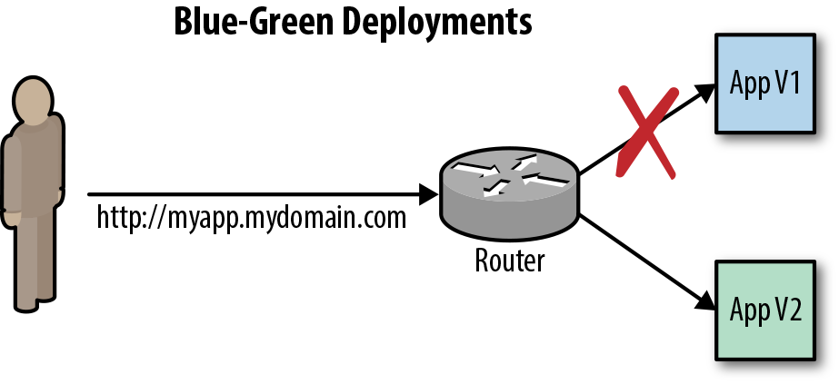

# Exercise 3. - Application Development on OpenShift Platform

## Learn more
[Important information](Tudnivalok.md)

**Important:**
- OpenShift Conventions:
  - Username: studentxy - where x y is the initials of your names eg studentnz (lowercase)
  - Project names: practiceNxy - N number of practice, x, y see previous, eg practice2nz (lowercase)
- Everyone uses your own user to work separately!

## Task 1. - Deployment Triggers, Deployment Strategies
**Duration: ~ 10 minutes **

### Purpose, description

**Deployment Triggers**
Events that require reinstallation:
1. Config - configuration changes, eg the deployment strategy or some kind of monitoring is included
2. Image - changes in Image, eg. new version builds

**Deployment Strategies**
How to deploy the application.
1. Rolling - no stops, new containers are launched while the old ones are descending.
2. Recreate - scale down the old one to 0 and then start the new one


**Deployment Monitors**
The purpose of this exercise is to test the _readiness_ and _liveness_ application testers.
By configuring these, you can automate your application control.
- Readiness probe: Has the application started and is it ready for operation?
- Liveness probe: Does the application work?


```shell
oc login -u developer -p developer
oc new-project gyakorlat6nz
oc new-app devopswithopenshift/welcome:latest --name myapp
oc expose service myapp

#then at this point you should follow the events on OpenShift Console, you can of course be in CLI
## Scaling to make it more spectacular
oc scale --replicas=3 dc myapp

# Check the Deployment Strategy and Triggers
oc describe dc myapp
oc set probe dc/myapp --readiness --open-tcp=8080 --initial-delay-seconds=5 --timeout-seconds=5
oc set probe dc/myapp --liveness -- echo ok
#az előbbi lépéseknél szépen lekövethető a Rolling release működése
oc set probe dc myapp --remove --readiness --liveness

# Check application run
while true; do curl -I http://myapp-gyakorlat6nz.127.0.0.1.nip.io/ 2>/dev/null | head -n 1 | cut -d$' ' -f2;sleep 1;done

# manual deployment trigger = manual installation
oc rollout latest myapp

# Deployment strategy change
oc patch dc myapp -p '{"spec":{"strategy":{"type":"Recreate"}}}'
```

## Task 2. - Blue / Green, A / B, Canary deployments
**Duration: ~ 10 minutes **

### Purpose, description
The aim of the exercise is to try out different deployment strategies.

**Blue/Green deployment**

The entire application stack is installed in duplicate and a command to decide which end users are to reach
```shell

oc login -u developer -p developer
oc new-project gyakorlat7nz
oc new-app https://github.com/devops-with-openshift/bluegreen#master --name=blue
oc expose service blue --name=bluegreen

oc new-app https://github.com/devops-with-openshift/bluegreen#green --name=green

# route change
oc patch route/bluegreen -p '{"spec":{"to":{"name":"green"}}}'
```

**A/B deployment**
Several versions are installed and someone in some percentage / or other terms sees someone else's version.
```shell
oc annotate route/ab haproxy.router.openshift.io/balance=roundrobin
oc set route-backends ab cats=100 city=0
```
**Canary deployment**
Several versions are installed and allow users to access the new solution under certain conditions. You need to configure the HAProxy template for this.


### For Protocol
Answer a question related to the topic.

 
